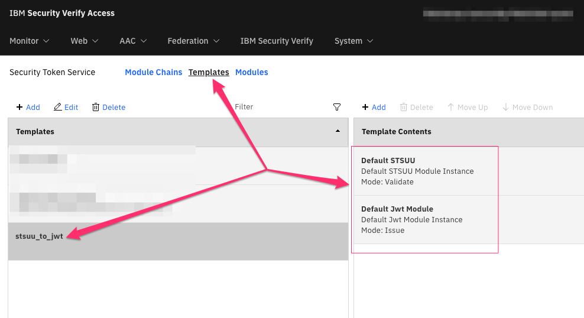
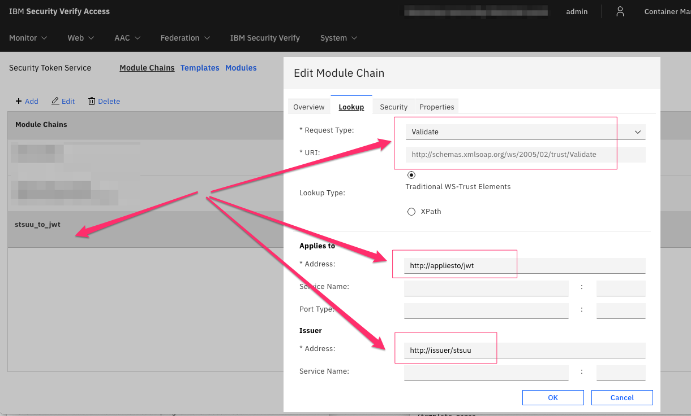

# FedCM Identity Provider support for IBM Security Verify Access

This directory contains assets required to configure ISVA as a FedCM identity provider. Note that this implementation is a prototype, and evaluating suitability for any production deployment is your own responsibility. The code is provided as-is, for example purposes, and you are free to modify it as you see fit.

## Use cases

The assets provided here at the time of writing permit configuration and testing of ISVA as a FedCM identity provider. This has been tested using the companion [ISVA relying party](../rp/README.md) implementation. 

The setup instructions here will focus on configuring ISVA as a FedCM IDP, and assume some prior knowledge about other ISVA administrative functions.

Note: At the time of writing, only the Chrome browser (I used version 125) supports FedCM.

Read more about the current status of the [Federated Credential Management API](https://developers.google.com/privacy-sandbox/3pcd/fedcm) on Google's website.

## Hosting the well-known file

The FedCM protocol currently requires hosting of a discovery document at your eTLD+1 domain. For example if your IDP hostname is www.myidp.ibm.com, then a document must be hosted at `https://ibm.com/.well-known/web-identity`. This is really only possible if you control the domain. I do not for ibm.com, so I tested this setup on a personal domain where I could host a page at my eTLD+1 location. You can read more about this requirement in the [Using the FedCM API](https://developers.google.com/privacy-sandbox/3pcd/fedcm-developer-guide#use-api) documentation.

The Lua HTTP transformation asset included in this repo caters for returning the `.well-known/web-identity` URL, although you can obivously host it outside of the ISVA server as well if you want. Either way, this is a requirement for using FedCM, and one of the pre-requisites you will need to satisfy before you can setup an IDP. Chrome does have some special flags for testing purposes, and you can read about those at the link above as well.

## ISVA Pre-requisites

The FedCM IDP implemenation has been written using a combination of Lua HTTP transformation rules, and the ISVA Federation Security Token Service. This means the base and federation modules must be activated.

FedCM is designed for Identity Providers that have long-lived authentication sessions, since the way the protocol works requires the browser to be able to retrieve account information from the IDP without forcing the user to always reauthenticate. As such, it is a recommendation of this README that when ISVA as a FedCM IDP, we enable the cookie-based "remember-me" capability so that, independently of in-memory (active) sessions managed by the `PD-S-SESSION-ID` cookie, the browser also has a way to use a persistent cookie to make calls on behalf of the authenticated user.


### Configuring ISVA for remember-me persistent cookies

For documentation related to configuring remembered sessions, see the [Persistent Sessions](https://www.ibm.com/docs/en/sva/10.0.8?topic=state-persistent-sessions) documentation.

For complete stanza reference information, see the [[remember-me] stanza](https://www.ibm.com/docs/en/sva/10.0.8?topic=reference-remember-me-stanza) documentation.

You can do quite a few different things with the remember-me persistent cookie capability, however here we will document basic configuration required for maintaining a cookie that will work with the FedCM capability. Here's what I ended up choosing:

```
[remember-me]

# use a cookie with the name: verify-access-persistent-session
remember-session-field = cookie:verify-access-persistent-session

# remember forever
remember-session-lifetime = -1

# change this
remember-session-key-label = WebSEAL-Test-Only

# make these attributes part of the remember-me cookie contents
remember-session-attribute-rule = +AUTHENTICATION_LEVEL
remember-session-attribute-rule = +email
remember-session-attribute-rule = +displayName
```

In my environment, when a session is normally created for a user, the `email` and `displayName` attributes are read from LDAP. Since we also want them to be available to the FedCM relying-party, I decided to include their values in the remember-me cookie. This will allow the Lua-based FedCM IDP to read them directly from the session credential rather than having to look them up at runtime from LDAP, etc.

### Configuring the remember-me persistent cookie to use SameSite=None

It is a requirement for cookies used at the IDP in requests from the browser (when its making FedCM requests) to have set the `SameSite=None` attribute. You can read about that in the documentation for the [Accounts](https://developers.google.com/privacy-sandbox/3pcd/fedcm-developer-guide#accounts-list-endpoint) and [ID Assertion](https://developers.google.com/privacy-sandbox/3pcd/fedcm-developer-guide#id-assertion-endpoint) endpoints in the [FedCM developer guide](https://developers.google.com/privacy-sandbox/3pcd/fedcm-developer-guide).

In the WRP configuration file this is done as follows:

```
[cookie-attributes]
verify-access-persistent-session = [-unsupported-same-site]SameSite=None
```

If your `PD-S-SESSION-ID` cookie was long-lived, you could also use that instead of the remember-me cookie, but it is still a requirement that `SameSite=None` is set, because if it isn't then the browser won't sent it in FedCM requests to the IDP and the request will not represent the user that you wish to sign in as.


## Configuring ISVA for FedCM Identity Provider

Now that persistent session cookies are establishing, using the cookie attribute `SameSite=None`, its time to configure the ISVA server to act as a FedCM IDP.

### Editing the fedcm.lua HTTP transformation file

Toward the top of the [fedcm.lua](./httptransformation/fedcm.lua) file you will find variables that define the expected hostname as seen by the browser for this IDP, and also the permitted clients:

```
local hostname = "www.myidp.ibm.com"
local clientList = {}
clientList["c892ed5a-9f60-4f1f-8ace-eef3ac904a72"]={
	origin="https://www.mysp.ibm.com",
	privacy_policy_url="http://ibm.com/privacy-policy.html",
	terms_of_service_url="http://ibm.com/terms-of-service.html"}

```

Update the `hostname` and `clientList` for your intended environment. The client ID just needs to be unique - just generate a new UUID for your client(s). The `origin` value is critical, and will be checked as part of the runtime flow. Of course you should also update the `privacy_policy_url` and `terms_of_service_url` as appropriate for your IDP and client(s). These can be different per-client if you wish.

### Configuring ISVA with the fedcm.lua HTTP transformation file

First import some utility HTTP transformation files that are used by the [fedcm.lua](./httptransformation/fedcm.lua) file. These can be found as assets from earlier previous blog [Lua HTTP Transformations in IBM Security Verify Access](https://community.ibm.com/community/user/security/blogs/shane-weeden1/2024/05/21/lua-http-transformations). A direct link to these files is here: [https://github.com/sbweeden/blog_assets/tree/master/lua_http_transformations](https://github.com/sbweeden/blog_assets/tree/master/lua_http_transformations). You will need:
 - LoggingUtils.lua
 - FormsModule.lua
 - STSClient.lua

Load each of these in the `Web->HTTP Transformation` section of the LMI.

Then import the updated [fedcm.lua](./httptransformation/fedcm.lua) file.  Deploy that change, then edit the WRP configuration file to add the required HTTP transformation entries:
```
[http-transformations]
fedcm = fedcm.lua

[http-transformations:fedcm]
request-match = request:GET /.well-known/web-identity *
request-match = request:GET /fedcm/config.json *
request-match = preazn:GET /fedcm/accounts *
request-match = request:GET /fedcm/client_metadata*
request-match = preazn:POST /fedcm/id_assertion *
request-match = preazn:POST /fedcm/disconnect *
request-match = postazn:GET /fedcm/login *
```
Note that the first entry above is for returning the `./well-known/web-identity` file, which must be hosted at your eTLD+1 domain. In my case I had my ISVA WRP accessible from both the eTLD+1 domain (e.g. `https://mydomain.com`) and also from a host within this domain (e.g. `https://myidp.mydomain.com`) so having this HTTP transformation in place on the one WRP made sense. If your ``./well-known/web-identity` file is hosted separately, then obviously you don't need this first entry.

Pay close attention to the different [transformation stages](https://www.ibm.com/docs/en/sva/10.0.8?topic=transformation-stages) that the various request-match entries use. These are important. Those using the `request` transformation stage will be intercepted very early in WRP processing - and don't require any authentication for access.

Those using the `preazn` stage require authentication for access, and this is where the remember-me cookie will be used by the browser.

The last entry, for `/fedcm/login` uses the `postazn` stage, and this is also after both authentication and authorization have completed. This is used in the edge case where the browser thinks the user is logged in at the IDP, but the session has expired. The user needs to reauthenticate and this occurs via a small pop-up window. The user then logs in via your normal login page in this flow and should be subject to regular authorization for this URL. You can read more about the [Login URL](https://developers.google.com/privacy-sandbox/3pcd/fedcm-developer-guide#login-url) in the documentation.

### Create STS template and chain for issuing JWT

The `fedcm.lua` HTTP transformation is responsible for creating an SSO token that is validated by the relying party. Whilst the standard itself doesn't define a particular format for an SSO token, a JWT token is generated by this implementation. This is in keeping with the practice observed with the Google IDP.

You can see details of the claims included in this JWT by looking at the `generateAssertionToken` function of the [fedcm.lua](./httptransformation/fedcm.lua) file.

To issue the JWT token the `fedcm.lua` uses the utility functions from `STSClient.lua` to call an STS chain in the ISVA Federation Security Token Service. 

As such, you need to create an STS Chain Template (I called mine `stsuu_to_jwt`) with two modules:

| Token Type | Mode | 
|------------|------|
| Default STSUU | Validate |
| Default JWT Module | Issue |

 

You then create an STS Module Chain which instantiates this template, with the following lookup properties:

| Property | Value | 
|------------|------|
| Token Type | Validate (http://schemas.xmlsoap.org/ws/2005/02/trust/Validate) |
| AppliesTo Address | http://appliesto/jwt |
| Issuer Address | http://issuer/stsuu |


If in any doubt, just make sure that the Lookup parameters for the module chain match how the chain is being called in the `generateAssertionToken` function of the `fedcm.lua` file. There is no need to set any properties on the STSUU or JWT modules in the module chain.




### Integrating the Login Status API

The [Login Status API](https://developers.google.com/privacy-sandbox/3pcd/fedcm-developer-guide#login-status-api) is a process by which the IDP informs the browser as to whether or not the user has a current session. Ideally the API informs the browser both when the user authenticates and when they log out. 

How you integrate with this API will depend upon how users authenticate to your IDP, and what page content is served to the user that might detect whether or not the user is logged in. In my testing environment, each page displays a welcome banner at the top, which is making use of a fetch API call to the [cred-viewer local application](https://community.ibm.com/community/user/security/blogs/shane-weeden1/2020/12/04/rip-epacjsp-2007-2020). Given this fetch call returns the user credential on each main page load, and from that you can tell if the user is authenticated, then this was a good place to determine whether or not the user was logged in. I added a piece of javascript in the fetch chain, as follows:

```
function updateLoginStatus(str) {
	// see https://developers.google.com/privacy-sandbox/3pcd/fedcm-developer-guide#login-status-api
	let allowedStatus = [ "logged-in", "logged-out", "unknown" ];
	if (navigator != null && navigator.login != null && typeof navigator.login == "object" 
			&& navigator.login.setStatus != null && typeof navigator.login.setStatus == "function"
			&& allowedStatus.indexOf(str) >= 0) {
		console.log("Setting Login Status to: " + str);
		navigator.login.setStatus(str);
	} else {
		console.log("Unable to set login status");
	}
}

// this function is called on page load
function getWhoAmI() {
    fetch(
        '/ivcreds',
        {
            'method': 'GET',
            'headers': {
                'Accept': 'application/json'
            }
        }
    ).then((response) => {
        return response.json();
    }).then((data) => {
        if (data["AZN_CRED_PRINCIPAL_NAME"] != null &&  data["AZN_CRED_PRINCIPAL_NAME"] != "unauthenticated") {
            updateLoginStatus("logged-in");
        } else {
            updateLoginStatus("logged-out");
        }

        // do other stuff to display the logged in user information
    });
}
```

Of course this required the `cred-viewer` local application to be enabled in the WRP:

```
[local-apps]
cred-viewer = ivcreds
```

And be sure to allow unauthenticated access to the `/ivcreds` URL such that it can be retrieved even when unauthenticated.


There are of course other ways you can integrate with the login status API, including javascript similar to that shown above in the WRP logout page (without having to do a fetch since you know its the logout success page), or by using Lua HTTP transformations on a response to detect the login status and sending the `Set-Login` response HTTP header. In any case, what integration points you choose will largely depend on how your website works. For the best experience though, be sure to use this API, particularly when the user authenticates otherwise FedCM will not show anything to the user at the RP when trying to SSO.


## Testing FedCM

Testing FedCM requires the right browser (at time of writing only Chrome has a known implementation) and a relying-party site configured to use this IDP. Information for [setting up a relying-party using IBM Security Verify Access can be found here](../rp/README.md). Obviously instead of using the Google IDP documented in that readme, use the IDP configuration as described here, and make sure you set the client id and origin of the RP to match your IDP and SP configurations together.

Pay close attention to the browser console, and both the message log and request of your IDP web reverse proxy to debug any issues. 

Login to the IDP first (its a good idea to add trace in your IDP javascript when using the Login Status API so you know that the browser has been instructed that the user is authenticated), then visit the RP's FedCM AAC policy URL to initiate FedCM login. Again, monitor the browser's console, and the IDPs message log and request log to see which APIs are being called and when. The authentication sequence should be exactly as documented in the [RP README](../rp/README.md).

## Final thoughts

The FedCM protocol is an interesting departure from traditional SSO protocols such as SAML and OpenID Connect. It is not a replacement for these protocols, as is well documented in the [FedCM overview](https://developers.google.com/privacy-sandbox/3pcd/fedcm#why_do_we_need_fedcm). For example if there is the browser determines (via the Login Status API) that the user is not logged in at the IDP, then the federated SSO popup will not be offered to the user. It is, for the most part, likely to remain the domain of IDPs that have long-lived sessions.

The IDP implementation provided here is only a prototype and not entirely complete - for example there is no attempt to fully implement the disconnect endpoint. That said, if you are looking to understand how FedCM works in the role of an identity provider, this implementation will give you the opportunity to experiment with it. Further, its a great exploration of some of the capabilities of the Lua HTTP Transformations now offered by IBM Security Verify Access.

