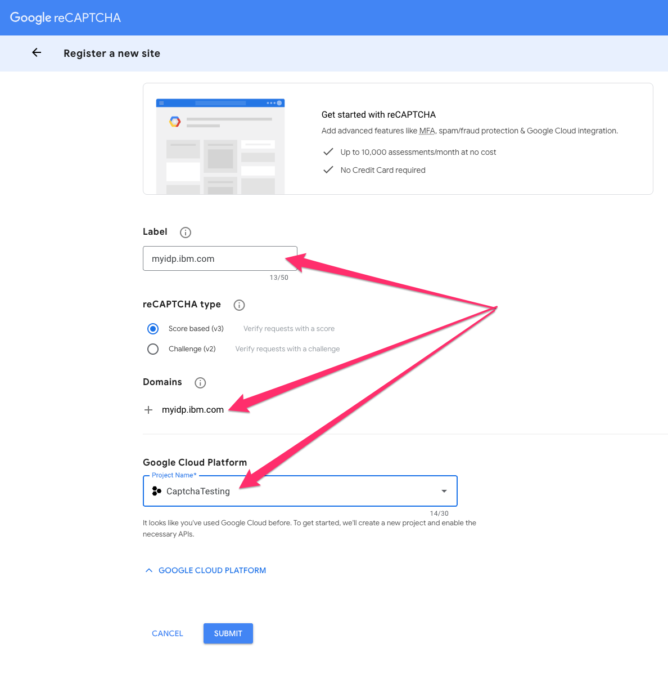
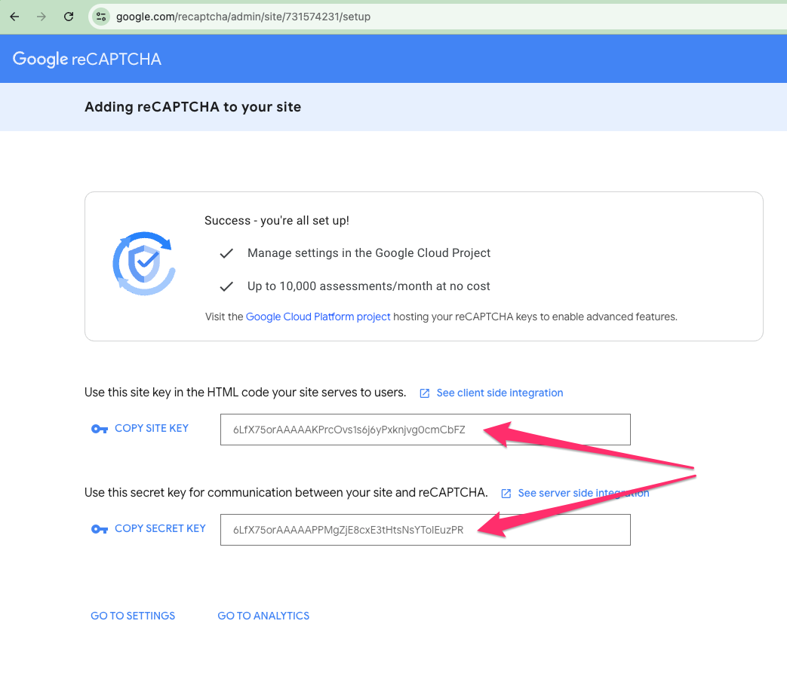
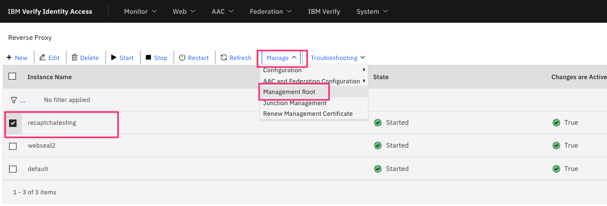
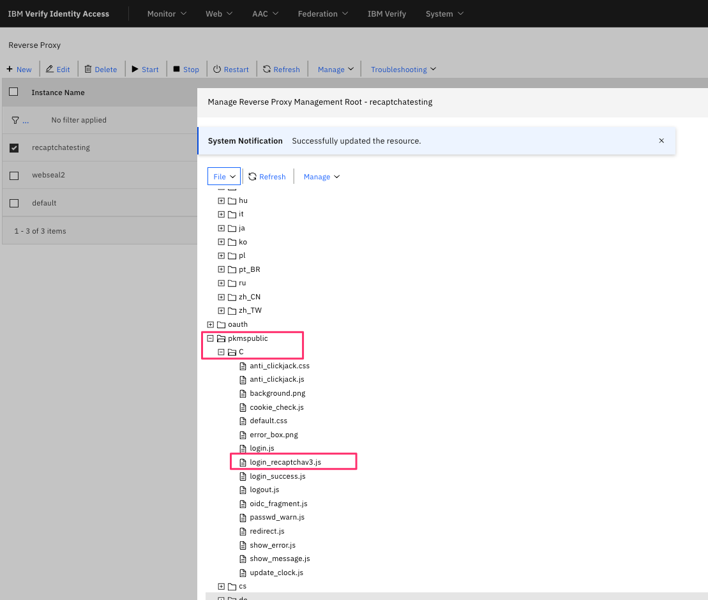
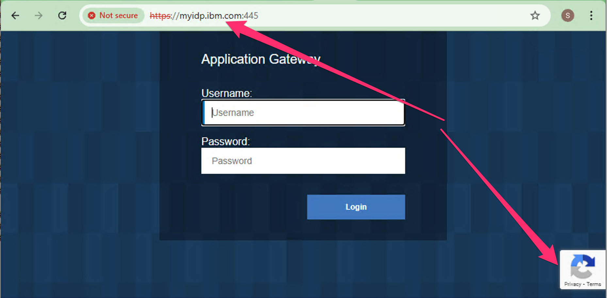
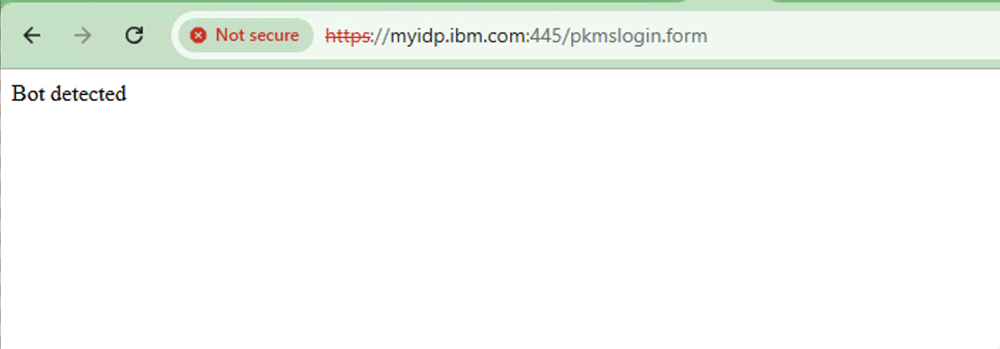

# Recaptchav3 for WebSEAL Forms Login

## Overview

Google's [recaptchav3](https://developers.google.com/recaptcha/docs/v3) API offers a risk-score based bot detection capability. This can be used for fraud detection in any transaction, and one such example is to mitigate credential stuffing attacks against username/password login forms.

The IBM Verify Idetity Access (IVIA) web reverse proxy (which I've know as WebSEAL for 20+ years and will continue to refer to by that name) has a default forms-based login capability which allows authentication of users against a configured user directory. This article will demonstrate how to add Google recaptchav3 support to WebSEAL forms-based login. 

## Details

### Configuring Google Recaptchav3

The first step is to go to the [Google Recaptchav3 administration console](https://www.google.com/recaptcha/admin/create) to create a site. For trial use, no fee is charged, and that is what I've used when setting up the demostration that follows. The name and domain for your site should match the hostname that browsers use to connect to your WebSEAL. In my case I am using a local hosts file (this is not a public site) to point my browser to `myidp.ibm.com`, and have named my configuration the same:




Note that after pressing submit you should save the site key and site secret as they will be used in future configuration steps. In my case these are:

| Property    | Value |
| ---------- | --------- | 
| Site Key | 6LfX75orAAAAAKPrcOvs1s6j6yPxknjvg0cmCbFZ |
| Secret Key |6LfX75orAAAAAPPMgZjE8cxE3tHtsNsYToIEuzPR |



### Preparing and uploading the Lua HTTP Transformation rule file


The Lua HTTP transformation rule can be found here: [recaptchav3_forms_login.lua](./http_transformations/recaptchav3_forms_login.lua)

You should download this file, and update these configuration parameters to reflect your site key and secret. Following on from my example configuration above, this would be:

```
local siteKey = "6LfX75orAAAAAKPrcOvs1s6j6yPxknjvg0cmCbFZ"
local secretKey = "6LfX75orAAAAAPPMgZjE8cxE3tHtsNsYToIEuzPR"
```

After editing the file, upload this in your IVIA installation using the LMI via `Web -> HTTP Transformations`

There are many comments at the start of this file indicating how to use it with WebSEAL. You can read them, and follow along with the instructions below to complete the configuration.

You will also need to obtain and upload a couple of other utility Lua transformation rules that I have written which are used by the `recaptchav3_forms_login.lua` rule:

| Lua HTTP Transformation rule name    | Source location |
| ---------- | --------- | 
| LoggingUtils | [https://github.com/sbweeden/blog_assets/blob/master/lua_http_transformations/LoggingUtils.lua](https://github.com/sbweeden/blog_assets/blob/master/lua_http_transformations/LoggingUtils.lua) |
| FormsModule | [https://github.com/sbweeden/blog_assets/blob/master/lua_http_transformations/FormsModule.lua](https://github.com/sbweeden/blog_assets/blob/master/lua_http_transformations/FormsModule.lua) |

### Instrumenting the WebSEAL login.html file

Navigate to `Web -> Reverse Proxy` then select the WebSEAL server you wish to work with, then select `Manage -> Management Root`:



Import the file [login_recaptchav3.js](./webseal_pages/pkmspublic/login_recaptchav3.js) then edit it to update the `siteKey` value with your site key captured earlier.




Next update the login page under `management/C/login.html` to instrument the inclusion of the Google recaptchav3 APIs and this new JS file. At the end of the `<head>` section of `login.html`, add (updating your site key):

    <script src="https://www.google.com/recaptcha/api.js?render=YOUR_SITE_KEY"></script>
    <script src="%PKMSPUBLIC%login_recaptchav3.js"></script>

A sample modified [login.html](./webseal_pages/management/login.html) is included for reference, though the `YOUR_SITE_KEY` piece still has to be updated.

### Updating the WebSEAL content-security-policy

If you are using a recent version of IBM Verify Identity Access, chances are that the WebSEAL server is configured to use a fairly strict content security policy response header that will prevent the Google recaptcha APIs that are embedded into the `login.html` file from loading. This can be rectified by updating the WRP configuration file to change the default response header for the content security policy. In my system, I changed it as follows:

```
[acnt-mgmt]

http-rsp-header = content-security-policy:TEXT{default-src 'self'; frame-ancestors 'self'; form-action 'self'; script-src 'self' https://www.google.com/recaptcha/api.js https://www.gstatic.com/recaptcha/; frame-src https://www.google.com/; connect-src 'self' https://www.google.com/recaptcha/;}
```

You can experiment with this if you wish - watch the Browser console as the WRP login page loads and look for any errors. This is how I discovered what the issues were, and modified the CSP response header to suit. You could of course remove the `content-security-policy` response header entirely, but it is there as part of good security best practices, so it is advisable to leave it in place, and make the adjustments that you need.

### Configure WebSEAL to use the HTTP transformation rule
While in the WRP config file, configure the HTTP transformation rule to intercept `POST` requests to `/pkmslogin.form`, as follows:

```
[http-transformations]
recaptchav3_forms_login = recaptchav3_forms_login.lua
 
[http-transformations:recaptchav3_forms_login]
request-match = request:POST /pkmslogin.form *
```

## Testing the solution
Try a login to your WebSEAL. When the page loads now, you should see the recaptchav3 logo in the bottom right of the screen:



If you monitor the WRP msg log while performing login, you should see debug trace like that shown when retrieving a risk score from the Google API:

```
-- recaptchav3 invoked with params: {["secret"] = 6LfX75orAAAAAPPMgZjE8cxE3tHtsNsYToIEuzPR,["response"] = 03AFcWeA4VUqCt0KwA-30NGW-Q4haV_TRUNCATED
-- Received evaluation response: { "success": true, "challenge_ts": "2025-08-05T06:57:19Z", "hostname": "myidp.ibm.com", "score": 0.9,  "action": "submit" }
```

All going well of course, you don't see anything new - just the successful landing page after login. To see what happens if you had have been detected as a bot however, try modifying the score threshold within the `recaptchav3_forms_login.lua` file (set the threshold to 1.0 for example):

```
--
-- Risk score threshold. Scores below this number will result in a denied page.
--
local RISK_SCORE_THRESHOLD = 1.0
```

When testing with that impossibly high threshold, my browser displays a rather crude error response:



You can modify the error responses in the `recaptchav3_forms_login.lua` file.

There are a couple of other controls you can adjust in the transformation rule for restricting the validity period of a recaptcha token, and for validating the `action` parameter. You can read about these in embedded comments in the provided transformation rule.

## The wrap

There are many different scenarios where you might want to use bot detection in web applications and proxies like WebSEAL. This article has demonstrated a very specific integration into WebSEAL's forms-based login processing using Lua HTTP transformation rules, however the same technique could easily be applied to Advanced Access Control authentication policies written in Infomap Javascript.
