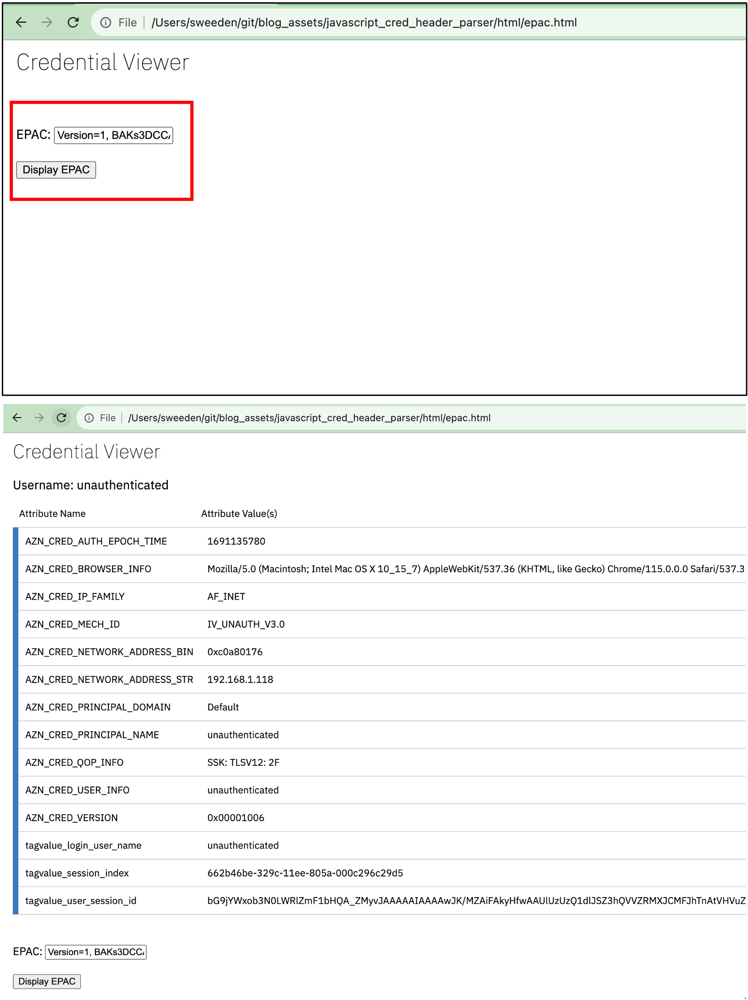
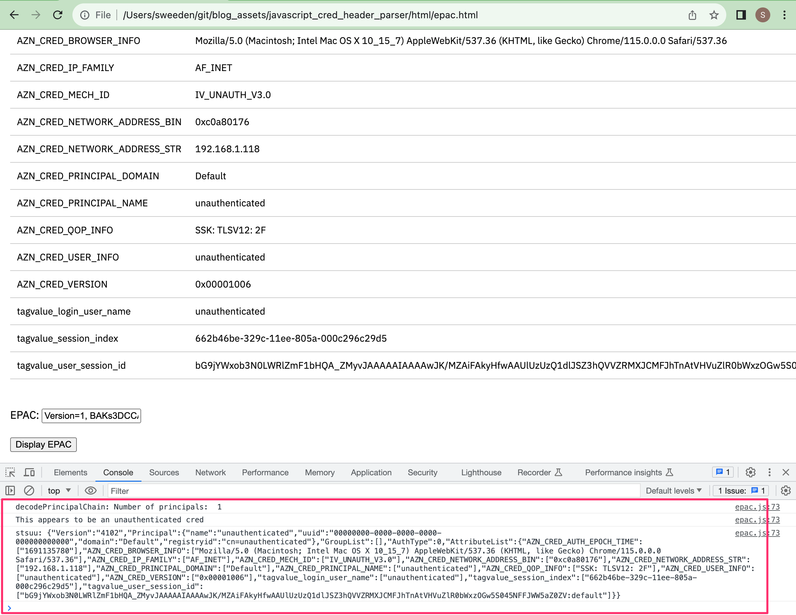

# Javascript Credential Parser

This example demonstrates how to parse the iv-creds header from IBM Security Verify Access (ISVA) in Javascript.

Two use cases are covered:
 - A browser-based IBM Security Verify Access credential viewer
 - Using the parsing technology from ISVA Javascript contexts such as server-side template page scripting and InfoMap authentication mechanisms


## Fast start - standalone browser-based credential viewer

Clone the repository, then just open the epac.html in your browser, such as:

file:///your/path/to/blog_assets/javascript_cred_header_parser/html/epac.html

Paste in a captured iv-creds header value, and press the button. There is a sample value included in the page by default, and this contains a canned "unauthenticated" credential.



If you open the browser console, you can see debug tracing being output for various stages of the parsing process.



## Using the parser in IBM Security Verify Access

To use the Javascript credential parser from ISVA Javascript contexts such as mapping rules (Including InfoMap) and template page scripting, first import the following files as mapping rules:
  - `mappingrules/asn1tool.js` as mapping rule name "ASN1"
  - `mappingrules/credparser.js` as mapping rule name "CredParser"

The following subsections contain some more guidance on two of the most common use cases - template page scripting and InfoMap authentication mechansims.

### Parsing iv-creds in server-side template page scripting

For background on ISVA server-side template page scripting, see: https://www.ibm.com/docs/en/sva/10.0.6?topic=files-template-file-scripting

You can use the credential parser from within template files that have access to request HTTP headers, in the following manner:

  - Set advanced config parameter `sps.httpRequestClaims.enabled=true`
  - From within the template page:
```
<%
    importMappingRule("CredParser");
    
    // this is optional, but demonstrates a novel way of dumping debug information in the returned page itself
    // just remove the function completely when not debugging
    function debugLog(s) {
    	templateContext.response.body.write("<!-- debug: "+ s +" -->");
    }

    let ivCredsJSON = decodePACHeader(templateContext.request.headers["iv-creds"][0]);

    // now ivCredsJSON will contain all the credential attributes
%>
```

### Parsing iv-creds in an InfoMap authentication mechanism


For background on InfoMap authentication mechanisms see: (An Introduction to the InfoMap Authentication Mechanism)[https://community.ibm.com/community/user/security/blogs/shane-weeden1/2016/11/29/an-introduction-to-the-infomap-authentication-mech]

To use the credential parser from within an InfoMap:
```
importClass(Packages.com.tivoli.am.fim.trustserver.sts.utilities.IDMappingExtUtils);
importMappingRule("CredParser")

// declaring this function will put credential parser trace in the runtime trace.log
// if you don't want to trace, just don't declare the function at all
function debugLog(s) {
	IDMappingExtUtils.traceString(s);
}

let ivCredsHeader = context.get(Scope.REQUEST, "urn:ibm:security:asf:request:header", "iv-creds");

let ivCredsJSON = decodePACHeader(''+ivCredsHeader);

// now ivCredsJSON will contain all the credential attributes
```


## Some other things to note

* This code is provided as-is, with no warranty or support. Use at your own risk.
* It is important to only use this tool with values of iv-creds header from a trusted source as no significant effort has gone into ensuring that badly formatted values are well handled.
* This tool makes use of other open source libraries (specifically code form `mappingrules/asn1tools.js`), and those libraries and their licenses are embedded in this repository so the HTML viewer tool works standalone when you clone the repository without having to go pull in source from other locations. The `mappingrules/asn1tools.js` lists all of the open source libraries that were used, and the location that the files originally came from. I'd like to acknowledge and thank the authors of those libraries.


